# Yapay Zeka Destekli Tasarım Üretim ve Yükleme Süreci

Bu proje, Print-on-Demand (POD) iş modeliyle çalışan e-ticaret mağazaları için tasarım üretim, optimizasyon ve raporlama süreçlerini uçtan uca otomatize etmeyi amaçlamaktadır. Özellikle öğretmen meslek grubuna yönelik (niche) tasarımların seri üretimine odaklanan bu RPA robotu; manuel iş yükünü ortadan kaldırarak hızlı, SEO uyumlu ve baskıya hazır (print-ready) ürünler elde edilmesini sağlar.

<div align="center">
  <a href="https://www.youtube.com/watch?v=lKNK3GO1aPI">
    
  </a>
</div>

## 🎯 Projenin Amacı

Bu projenin temel amacı, Print-on-Demand (POD) iş modeliyle çalışan e-ticaret mağazaları için tasarım üretim, optimizasyon ve raporlama süreçlerini uçtan uca otomatize etmektir. Özellikle öğretmen meslek grubuna yönelik (niche) tasarımların seri üretimine odaklanan bu RPA robotu; manuel iş yükünü ortadan kaldırarak hızlı, SEO uyumlu ve baskıya hazır (print-ready) ürünler elde edilmesini sağlar.

Geliştirilen RPA süreci ile manuel müdahale sadece kalite kontrol (tasarım seçimi) aşamasına indirgenmiştir. Proje kapsamında şu hedeflere ulaşılması amaçlanmaktadır:

* Ana Excel listesindeki şablon promptların farklı nişlere dinamik olarak uyarlanması ve onlarca farklı tasarımın otonom şekilde üretilmesi.
* Google Gemini AI entegrasyonu ile sıfır hatalı, arama algoritmalarına (SEO) tam uyumlu isimlendirmelerin yapılması.
* Görüntü işleme aşamasında devreye giren Python scriptleri (optimizasyon modülleri) ve arka plan temizleme işlemi için kullanılan birefnet-general yapay zeka modeli sayesinde, üretilen orijinal tasarım kalitesinin hiçbir kayba uğramadan birebir korunması ve şeffaf arka plan/300 DPI standartlarında baskıya tam hazır hale getirilmesi.

## 🛠️ Kullanılan Teknolojiler ve Entegrasyonlar

Proje, kurumsal güvenlik standartlarına uygun hibrit bir teknoloji mimarisi kullanılarak geliştirilmiştir:

* **UiPath Studio (State Machine):** Sürecin ana orkestrasyonunu, hata yönetimini ve durum geçişlerini üstlenen merkezdir.
* **Ideogram.ai & UiPath Computer Vision:** Yapay zeka ile görsel üretiminin yapıldığı platform ve bu platformdaki arayüz etkileşimlerini (buton tıklama, değer okuma) sağlayan yapay zeka destekli CV motorudur.
* **Google Gemini AI (Vision) & UiPath GenAI Activities:** Üretilen tasarımları analiz ederek SEO uyumlu RegEx isimlendirmeleri yapar ve sistem hatalarını doğal dile çevirir. Bağlantı, manuel (hardcoded) bir API Key ile değil; doğrudan UiPath Orchestrator / Integration Service üzerindeki güvenli "UiPath GenAI Activities" entegrasyonu ile sağlanmıştır.
* **Gmail (UiPath Integration Service):** İşlem başarıyla sonuçlandığında veya kritik bir hata oluştuğunda paydaşlara anlık bildirim gönderilmesini sağlar. Bağlantı, yerel kimlik bilgileri yerine doğrudan Orchestrator üzerindeki güvenli "Gmail" bağlantısı üzerinden otonom olarak yönetilir.
* **Python (Görüntü İşleme Motoru):** rembg ve Pillow kütüphaneleri ile birefnet-general yapay zeka modeli kullanılarak yapay zeka çıktılarının arka planını kayıpsız bir şekilde siler ve baskı standartlarına (300 DPI) tam hazır hale getirir.

## 📂 Süreç Akışı ve Sistem Mimarisi (Workflow)

Süreç, robotun kararlılığını artırmak ve hata yönetimini merkezileştirmek amacıyla Main.xaml üzerinde bir State Machine (Durum Makinesi) mimarisiyle tasarlanmıştır. Akış 3 ana evrede çalışır:

1. **Initialization:** Sistemin statik ayarları yüklenir ve taslak tasarım komutları (prompt), {NICHE} ve {OBJECTS} gibi dinamik etiketler kullanılarak farklı nişlere göre çoğaltılıp ana iş listesi (WIP) üretime hazır hale getirilir.
2. **AI: Design:** Ideogram platformunda yapay zeka ile görsel üretimi tetiklendikten sonra robot süreci duraklatarak kullanıcıya bir onay ekranı (Human-in-the-Loop) sunar. Kullanıcının üretilen alternatifler arasından en uygun tasarımı seçip bilgisayara kaydetmesiyle süreç otonom olarak devam eder. Kaydedilen ham tasarım, Google Gemini AI tarafından analiz edilerek algoritma dostu ve SEO kurallarına uygun şekilde otomatik isimlendirilir. Ardından POD platformlarının zorunlu baskı standartlarını sağlamak amacıyla Python görüntü işleme modülü devreye girer. Bu modül, arka plan temizleme işlemi için birefnet-general yapay zeka modelini kullanır; görselin arka planı tamamen transparan hale getirilir ve çözünürlüğü yüksek kaliteli baskı için 300 DPI seviyesine çıkarılır.
3. **Final State:** İşlem bitiminde güncel takip tablosu (WIP Excel dosyası), o günün tarihi (zaman damgası) ile dinamik olarak isimlendirilerek arşivlenir. Tüm analiz, raporlama ve arşivleme adımları tamamlandıktan sonra robot, sistem kaynaklarını serbest bırakmak ve temiz bir çalışma ortamı bırakmak adına aktif tarayıcı oturumlarını otonom olarak sonlandırır ve sistemi güvenli bir şekilde kapatır.

## ✉️ Akıllı Hata Yönetimi ve Raporlama

* **Gemini Destekli Çözümleme:** Herhangi bir teknik hata durumunda (Örn: Selector bulunamaması), State Machine (Durum Makinesi) devreye girip hatayı Gemini AI ile kullanıcı dostu bir metne çevirerek anında uyarı mesajı atar. (Örn: "NullReferenceException" yerine "İnternet koptuğu için resim indirilemedi.")

## 🚀 Kurulum ve Kullanım Kılavuzu

Bu otomasyonu kendi makinenizde çalıştırmak için aşağıdaki teknik önkoşulların sağlanması gerekmektedir:

### 💻 Sistem Gereksinimleri

* İşletim Sistemi: Windows ortamı.
* Python Çalışma Ortamı: Sistemde Python 3.10+ sürümü yüklü olmalıdır.
* Geliştirme Ortamı: UiPath Studio.

### ✅ Ön Hazırlık Adımları

* **Python Kütüphaneleri ve AI Modeli:** Görüntü işleme motorunun çalışabilmesi için terminal üzerinden `pip install rembg Pillow onnxruntime` komutunu çalıştırın. Arka plan silme işlemi için birefnet-general yapay zeka modelinin sisteme indirilmiş veya internet erişimiyle erişilebilir olması şarttır.
* **Klasör Yapısını Koruyun:** Projenin veri bütünlüğünü sağlamak için 01-Templates, 02-Work-In-Progress ve 03-Gemini-Temp gibi kök dizin klasörlerinin mevcut olması gerekir (Boş klasörler .gitkeep ile GitHub'da korunmuştur).

**Adım Adım Açıklayıcı Dosya Yapısı Kurulumu:**

1. a) Bu dosyayı kesin ve istediğiniz yere koyun uipath dosyası buradadır.
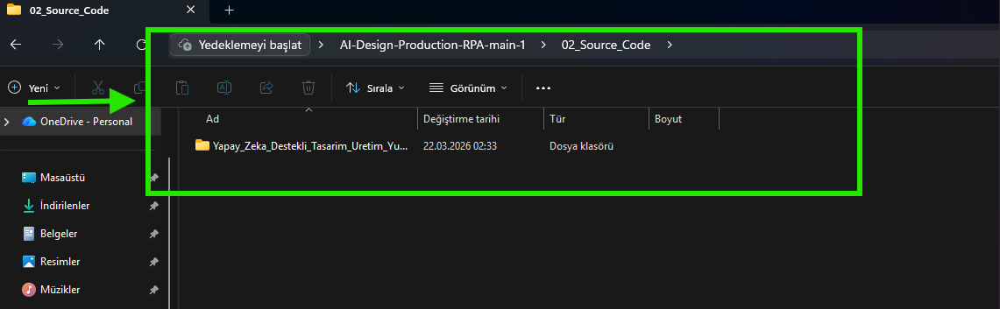
*Tarif: Bu görsel 02_Source_Code klasörünün içindeki proje dizininin nasıl konumlanması gerektiğini ve UiPath kaynak dosyalarının yerini gösterir.*

2. Config.xlsx dosyasını Yapay_Zeka_Destekli_Tasarim_Uretim_Yukleme_Sureci içine koyun.
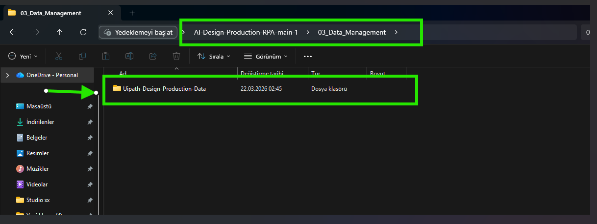
*Tarif: Bu görsel, Config.xlsx ayar dosyasının doğrudan ana proje klasörüne taşındığını gösterir.*

3. AI-Design-Production-RPA-main-1\03_Data_Management\Uipath-Design-Production-Data klasörünü kesin ve Yapay_Zeka_Destekli_Tasarim_Uretim_Yukleme_Sureci içine koyun.
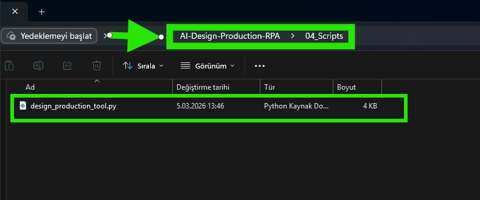
*Tarif: Şablonların, çalışma dosyalarının ve Python scriptinin bir arada durduğu ana veri yönetim hiyerarşisinin nasıl yapılandırılacağını gösterir.*

5. design_production_tool kesin ve Yapay_Zeka_Destekli_Tasarim_Uretim_Yukleme_Sureci içine koyun.
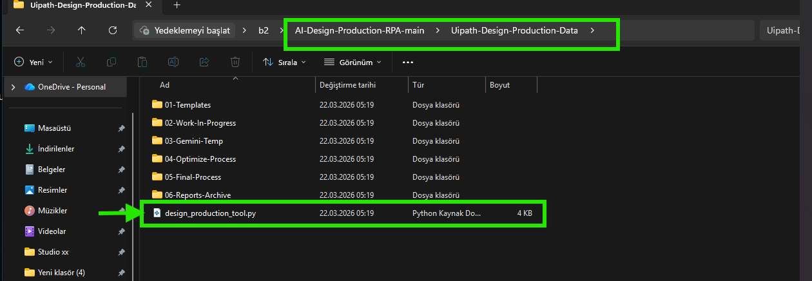
*Tarif: Bu resim, 04_Scripts klasörü içindeki görüntü işleme Python kodunun (design_production_tool.py) konumunu doğrular.*

Dosyanın son hali böyle olmalıdır.

* **Config Dosyasını Düzenleyin:** Config.xlsx yapılandırma dosyası içerisindeki yer tutucuları (Örn: Buraya “Alici Mail Adresi” Yazılacak.) kendi bilgisayarınızın dosya yollarıyla ve alıcı e-posta adresleriyle güncelleyin.
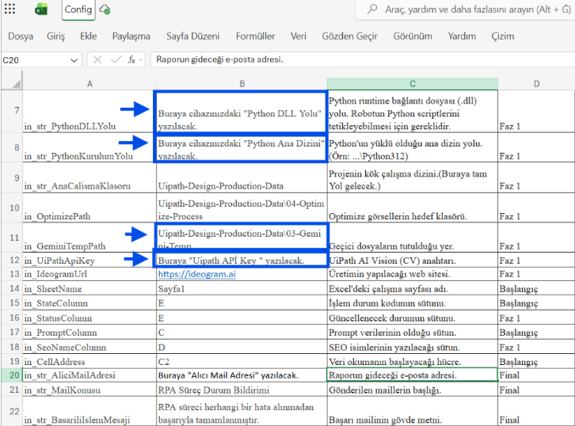
*Tarif: Config.xlsx dosyası içerisindeki düzenlenmesi gereken alanlar.*

**4. API ve Entegrasyonlar:**

* **Integration Service (Gemini & Gmail):** UiPath Orchestrator / Integration Service üzerinden UiPath GenAI Activities ve Gmail bağlantılarınızın yapılmış olduğundan emin olun. (Not: Bu iki servis için manuel API Key kullanılmaz, güvenli Orchestrator bağlantısı şarttır).

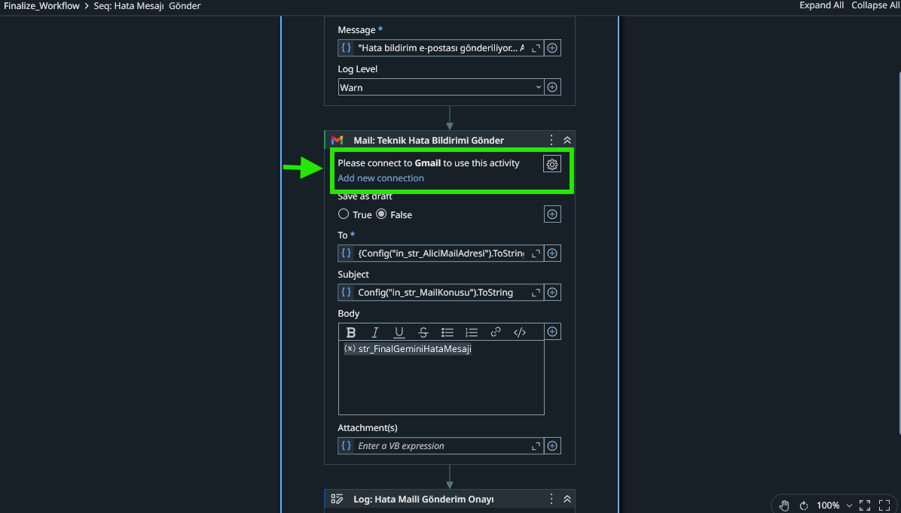
*Tarif: Teknik hataların bildirilmesi için kullanılan Gmail bağlantısı.*

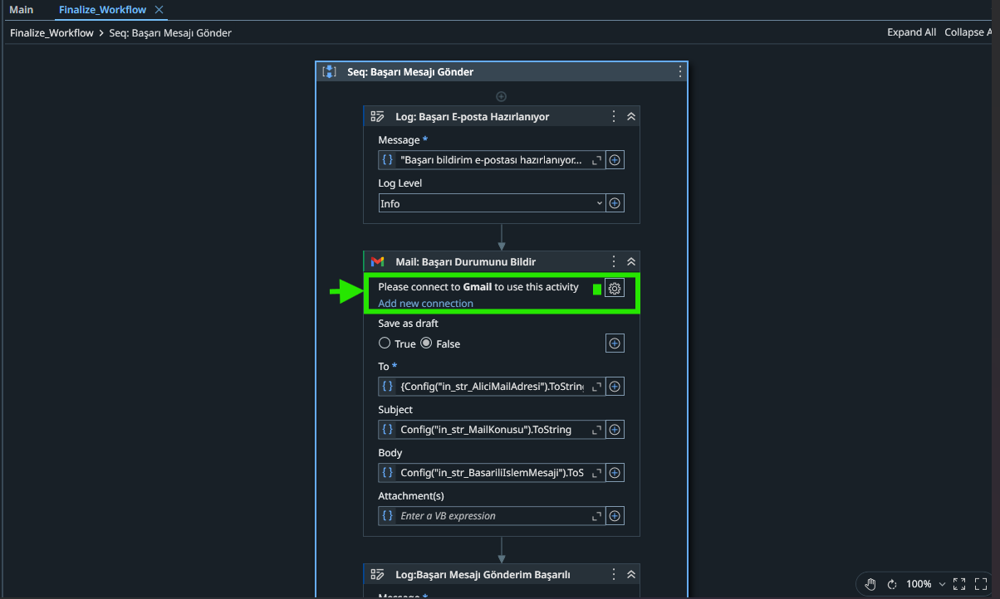
*Tarif: Süreç bittiğinde başarı raporu gönderen Gmail bağlantısı.*

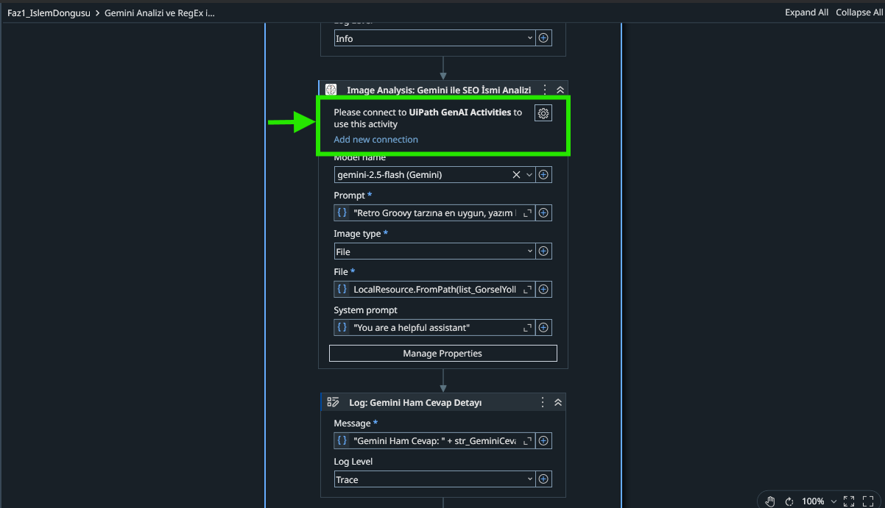
*Tarif: İlk aşama veri analizi için gerekli Gemini AI bağlantısı.*

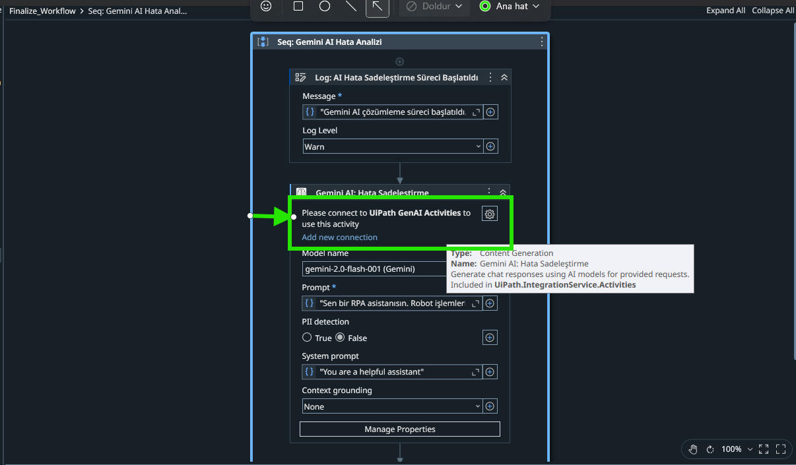
*Tarif: Hataları çözümleyen ve SEO odaklı isimlendirme yapan Gemini AI bağlantısı.*

* **Computer Vision (CV):** Ideogram arayüzündeki etkileşimler (buton tıklama vb.) için UiPath Proje Ayarlarından (veya Config dosyasından) UiPath Computer Vision API Key doğrulamasını mutlaka sağlayın.
* **Ideogram Platformu:** Platformda üretim yapabilecek yeterli kredinizin bulunduğundan ve tarayıcıda oturumunuzun açık olduğundan emin olun.

## 📂 Dosya Yapısı

```text
Yapay_Zeka_Destekli_Tasarim_Uretim_Yukleme_Sureci/
├── Main.xaml                       <-- (Ana robot akışı)
├── Main.xaml.json                  
├── entry-points.json               
├── project.json                    <-- (Bağımlılıklar ve global değişken kayıtları)
├── project.uiproj                  
├── Config.xlsx                     <-- (Ayar dosyası ana dizinde, Main.xaml ile yan yana olmalı)
└── Uipath-Design-Production-Data/  <-- (Tüm veri yönetiminin yapıldığı ana klasör)
    ├── design_production_tool.py   <-- ⚠️ Python scripti MUTLAKA bu klasörün içinde olmalıdır!
    ├── 01-Templates/               
    ├── 02-Work-In-Progress/        
    ├── 03-Gemini-Temp/             
    ├── 04-Optimize-Process/        
    ├── 05-Final-Process/           
    └── 06-Reports-Archive/
```

## 🛠️ Değişken Tanımlama Adımları

Projenin sürdürülebilirliği ve tüm alt akışların (Workflows) aynı ayar setine erişebilmesi için aşağıdaki yapılandırma zorunludur:

* **Değişken Adı:** Config
* **Veri Tipi:** Dictionary<String, Object>
* **Kapsam (Scope):** Global

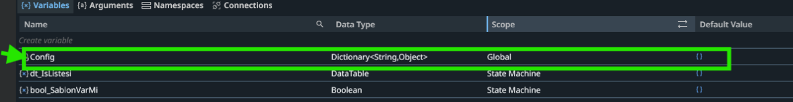
*Tarif: Bu görsel, UiPath Studio Variables panelinde Config değişkeninin Global olarak seçildiğini kullanıcılara göstermek için buraya eklenmiştir.*

**Not:** Config değişkeni, projenin en üst seviyesinde Global olarak tanımlanmalıdır. Bu sayede Config.xlsx dosyasından okunan "Giriş Klasörü", "E-posta Adresi" veya "Gecikme Süresi" gibi kritik parametreler, argüman kalabalığı yaratmadan tüm robot süreçleri tarafından kullanılabilir.

## ▶️ Otomasyonu Başlatın

Tüm ayarlar tamamlandıktan sonra Main.xaml üzerinden süreci başlatın. Robot, Ideogram platformunda üretimi gerçekleştirdikten sonra en iyi görseli seçmeniz için sizi bir mesaj kutusu ile bekleyecektir.

⚠️ **ÖNEMLİ KULLANICI ONAY AŞAMASI (MESSAGE BOX):**
Robot işlemi duraklatıp ekranda bir Message Box (Mesaj Kutusu) çıkararak "Resmi indirin ve tamam'a basın" talimatı verdiğinde;

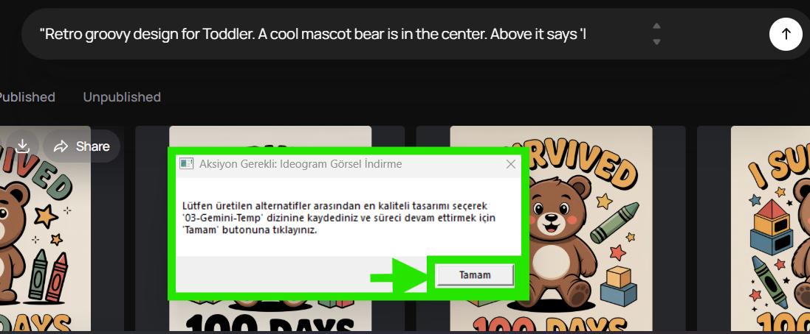
*Tarif: Ekrana çıkan UiPath onay kutusu.*

Seçtiğiniz resmi masaüstüne veya rastgele bir yere değil, **MUTLAKA proje içerisindeki 03-Gemini-Temp klasörünün içine kaydetmeniz gerekmektedir!** Resmi farklı bir yere kaydederseniz veya indirmeden direkt onaylarsanız robot sonraki adımlara geçemez ve hata verir.

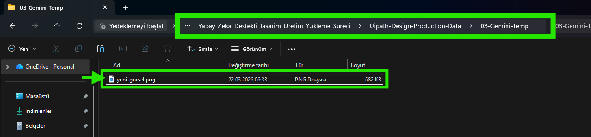
*Tarif: İndirilen görselin (yeni_gorsel.png) 03-Gemini-Temp klasörü içindeki doğru konumu.*

Kullanıcı olarak en kaliteli tasarımı seçip 03-Gemini-Temp klasörüne manuel kaydettikten sonra Tamam 'a tıkladığınızda; geriye kalan tüm işlemler (Gemini SEO Analizi, RegEx İsimlendirme, Python ile Arka Plan Silme ve Gmail Raporlama) saniyeler içinde otonom olarak gerçekleşir.

✨ Gelecek Planları (Future Roadmap)
Bu proje, modüler bir RPA mimarisi üzerine inşa edilmiş olup, gelecek sürümlerde aşağıdaki geliştirmelerin entegre edilmesi planlanmaktadır:

* Minimum Hard-Coding ve Kolay Kurulum: Projede sabit kod (hard-coding) kullanımı en aza indirilerek tüm kritik veriler Config.xlsx dosyasına bağlanmış ve son kullanıcı için hızlı/kolay kurulum sağlanmıştır. Gelecek aşamada, bu ayarların doğrudan UiPath Orchestrator Asset'lerine taşınarak tamamen bulut üzerinden yönetilebilir bir yapıya geçilmesi planlanmaktadır.

* Otomatik Yükleme (Auto-Upload) Entegrasyonu: Üretilen baskıya hazır (300 DPI) tasarımların, Gemini AI tarafından oluşturulan SEO başlık ve etiketleriyle birlikte hedef Print-on-Demand (POD) pazar yerlerine API veya arayüz (UI) otomasyonu ile doğrudan yüklenmesi.

* Otomatik Mockup Üretimi ve Pazarlama Otomasyonu: Şeffaf arka planlı tasarımların (PNG), Python görüntü işleme modülleri ile otomatik olarak sanal ürün görsellerine (tişört, kupa vb. mockup) dönüştürülmesi ve yapay zeka ile hazırlanan ilgi çekici metinlerle dijital pazarlama/sosyal medya kanallarında otonom olarak paylaşılması.
